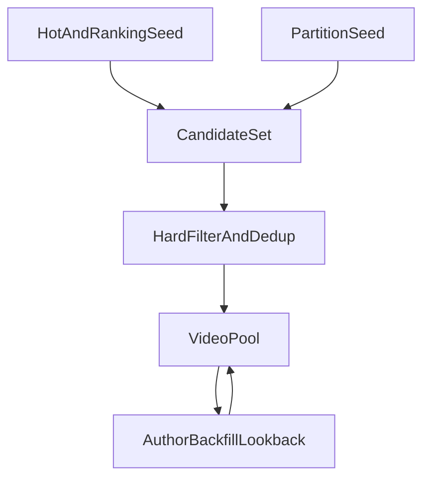

# 视频集合（video_pool）设计（v1）

目标：把“如何选取要采集的视频集合”定义成**可复现**、可扩展、可控成本的规则，便于后续写成任务调度与断点续跑逻辑。

---

## 1. 概念与输出

### 1.1 关键对象

- **候选视频（candidate）**：从任意入口发现的视频（可能重复、可能不满足筛选条件）
- **样本池（video_pool）**：最终要进入采集队列的视频集合
- **作者回溯扩展（author_backfill）**：从种子视频反向拿作者在过去 `lookback_days` 内的投稿，合并入 `video_pool`

### 1.2 `video_pool` 需要携带的字段（最小集合）

- `bvid`（主键）
- `source_type`：`hot` / `partition` / `author_expand` / `search_supplement`
- `source_ref`：来源标识（例如榜单 id、分区 tid、作者 mid、关键词等）
- `discovered_at`：首次发现时间
- `seed_score`：建池时的粗评分（用于排序/配额）
- `priority`：`low|normal|high`（用于调度优先级）

> 说明：建池阶段不要强依赖“完整元数据”，避免入口抓取过重；只要能稳定拿到 `bvid` 即可入候选，元数据在采集阶段补齐。

---

## 2. 总体建池流程（混合方案）

---

## 3. 数据来源（Seeds）

### 3.1 榜单/热门（`source_type=hot`）

**目的**：冷启动拿到高传播、高互动样本；后续用于“热点持续监控”。

- **抓取频率建议**：每 2 小时或每天（取决于你希望热点池更新速度）
- **入池规则**：只要能解析到 `bvid` 即记入候选
- **粗评分 `seed_score`（示例）**：
  - \(seed\\_score = w_1\\cdot view + w_2\\cdot like + w_3\\cdot reply + w_4\\cdot danmaku\)
  - **仅用于排序，不追求严格定义**；后续会被更正式的“流行度定义”替换

### 3.2 分区扩样（`source_type=partition`）

**目的**：围绕研究分区持续扩样，形成“研究可用的近全量样本”。

你可以选择两种强度：

- **轻量版（推荐第一版）**：分区榜单/分区热门 → 候选  
- **增强版**：分区搜索（时间切片）→ 候选

**分区筛选**：

- `tid` 白名单：研究关注的 1–3 个分区
- `tid` 黑名单：明显无关/干扰分区（可选）

### 3.3 关键词/事件补样（`source_type=search_supplement`，非主链路）

**目的**：构建论文中的专题实验组/对照组，或为某段时间的事件做扩样。

- **关键词集合**：论文主题关键词 + 对照关键词（建议版本化保存）
- **时间窗**：明确起止（例如事件前后各 7 天）
- **排序与截断**：记录搜索参数与页码范围，确保可复现

---

## 4. 硬筛选（Hard Filters）

硬筛选用于降低无效样本、减少后续抓取成本。建议第一版只做“低争议、低误伤”的过滤。

- **基础可访问性**：视频不可访问/已删除 → 直接剔除（记录原因）
- **分区过滤**：不在 `tid` 白名单 → 剔除或降权（看你的研究目标）
- **时长过滤（可选）**：极短视频（例如 < 15s）对多模态特征收益低，可剔除
- **投稿时间窗（可选）**：如果研究限定年份/月份，按 `pubdate` 过滤

> 注意：是否“必须在白名单分区”会影响作者扩展的覆盖。常见做法是：榜单/搜索入池严格按分区过滤；作者扩展入池允许少量跨分区但降权，避免样本池被作者的其他内容污染。

---

## 5. 去重与主键策略（Dedup）

- **主键**：`bvid`
- **去重规则**：同一 `bvid` 多来源命中时：
  - 合并成一条记录
  - `source_type` 保留“最强来源”（优先级：`hot > partition > author_expand > search_supplement`，可调整）
  - 同时把所有来源写入 `source_refs[]`（便于溯源）
  - `discovered_at` 取最早；`last_seen_at` 取最新（用于“是否仍在热点池”）

---

## 6. 作者扩展（`source_type=author_expand`）

你希望的策略是：从“热门/榜单 + 分区”得到的种子视频出发，**反向回溯这些视频的上传者在过去 `lookback_days` 天内上传的所有视频**，并把它们并入 `video_pool`，尽早启动更全面的数据采集。

### 6.0 超参数

- `lookback_days`：默认 90

### 6.1 触发规则（推荐第一版）

- 触发集合：来自 `source_type in {hot, partition}` 的种子视频对应作者（`owner_mid`）
- 对每个作者：抓取其投稿列表中 **`pubdate >= now - lookback_days`** 的全部视频（直到翻页结束或早于时间窗即可停止）
- 合并入候选集：`source_type=author_expand`，`source_ref=owner_mid`

### 6.2 扩展后的过滤

为减少样本污染与成本，你仍可保留可选过滤开关（但第一版可以先不开）：

- **分区一致性过滤（可选）**：只保留 `tid` 在白名单内（或同一大类分区）
- **时长过滤（可选）**：剔除极短视频
- **严格时间窗（默认开启）**：只保留过去 `lookback_days` 天

---

## 7. 版本化与可复现性

每次生成 `video_pool` 时，都应把以下参数写入 run 元数据（便于复现实验）：

- `seed_sources`（用了哪些榜单/热门入口）
- `partition_tid_whitelist` / `blacklist`
- `search_keywords` + `time_windows`
- `lookback_days`（作者回溯天数）

